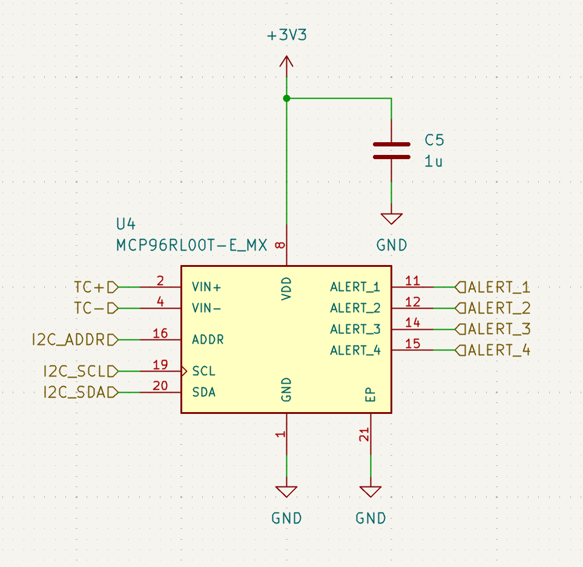

# payload-datalogger

Wirelessly configurable thermocouple data logging PCB implementing four MCP96RL00T on-board thermocouple to I2C converter ICs, an ESP32-C3 MCU, and flash storage.

## Screenshots

## BOM

See [this spreadsheet].(https://docs.google.com/spreadsheets/d/12Mr7GmqM8tnob1ocJkmMWgOL1p1aouqN9iYZXRkocOg/edit?usp=sharing)

**BOM cost:** $65 (on DigiKey, for two boards with attrition)
Does not include cables.

Additionally, batteries should be purchased elsewhere such as the suggested Amazon links to remain economical.