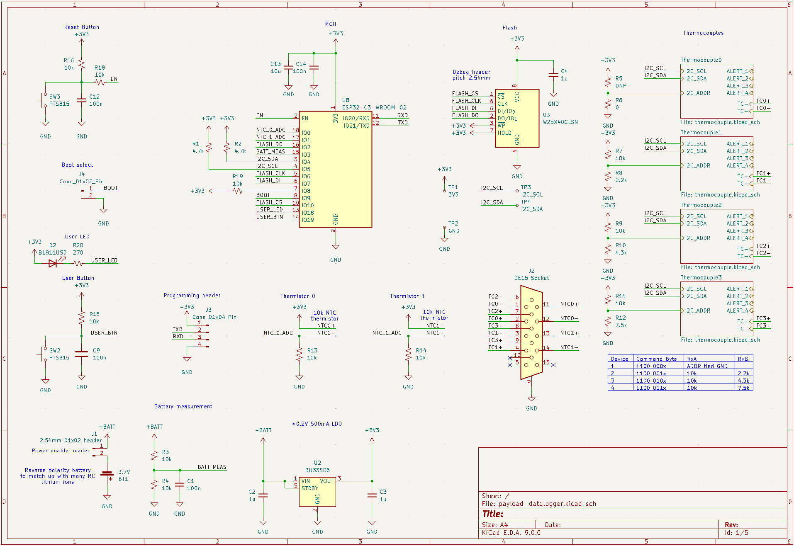

# payload-datalogger

Wirelessly configurable thermocouple data logging PCB implementing four MCP96RL00T on-board thermocouple to I2C converter ICs, an ESP32-C3 MCU, and flash storage.

## Screenshots

## BOM

| **References** | **Value** | **Footprint** | **Quantity** | **MPN** |
|---|---|---|---|---|
| C2, C3, C4, C5, C6, C7, C8 | 1u | C_0603_1608Metric | 7 | CL10B105KP8NNNC |
| C1, C9, C12, C14 | 100n | C_0603_1608Metric | 4 | CL10B104KB8NNNC |
| C13 | 10u | C_0603_1608Metric | 1 | CL10A106MQ8NNNC |
| R3, R4, R7, R9, R11, R13, R14, R15, R16, R18, R19 | 10k | R_0603_1608Metric | 11 | RC0603JR-0710KL |
| R1, R2 | 4.7k | R_0603_1608Metric | 2 | RC0603FR-134K7L |
| R6 | 0 | R_0603_1608Metric | 1 | RC0603JR-070RL |
| R8 | 2.2k | R_0603_1608Metric | 1 | RT0603FRE132K2L |
| R10 | 4.3k | R_0603_1608Metric | 1 | RT0603FRE074K3L |
| R12 | 7.5k | R_0603_1608Metric | 1 | RC0603FR-077K5L |
| R20 | 270 | R_0603_1608Metric | 1 | RC0603FR-07270RL |
| D2 | B1911USD | LED_0603_1608Metric | 1 | B1911USD-20D000114U1930 |
| U4, U5, U6, U7 | MCP96RL00T-E_MX | TQFN-20-1EP_5x5mm_P0.65mm_EP3.25x3.25mm | 4 | MCP96RL00T-E/MX |
| U2 | BU33SD5 | SSOP5_ROM | 1 | BU33SD5WG-TR |
| U3 | W25X40CLSN | SOIC-8_3.9x4.9mm_P1.27mm | 1 | W25X40CLSNIG |
| U8 | ESP32-C3-WROOM-02 | ESP32-C3-WROOM-02 | 1 | ESP32-C3-WROOM-02-H4 |
| SW2, SW3 | PTS815 | SW_Push_PTS815_SJM_250_SMTR_LFS | 2 | PTS815SJG250SMTR LFS |
| BT1 | 3.7V | JST_PH_B2B-PH-K_1x02_P2.00mm_Vertical | 1 | B2B-PH-K-S |
| J2 | DE15 Socket | DSUB-15-HD_Socket_Horizontal_P2.29x2.54mm_EdgePinOffset8.35mm_Housed_MountingHolesOffset10.89mm | 1 | ICD15S13E4GX00LF |
| J3 | Conn_01x04_Pin | PinHeader_1x04_P2.54mm_Vertical | 1 |  |
| J4 | Conn_01x02_Pin | PinHeader_1x02_P2.54mm_Vertical | 2 |  |
|  | Jumper |  | 2 | QPC02SXGN-RC |
|  | Battery option (3.7V 1000mAh) |  |  | https://www.amazon.com/dp/B0D9K7HQHT |
|  | Battery option (3.7V 2000mAh) |  |  | https://www.amazon.com/dp/B0CYWVSJKS |
|  | FTDI adapter |  |  | https://www.amazon.com/dp/B0BJKCSZZW |

**BOM cost:** $61 (on DigiKey, for two boards with attrition)

Additionally, batteries should be purchased elsewhere such as the suggested Amazon links, and 2.54mm pin headers should be supplied.